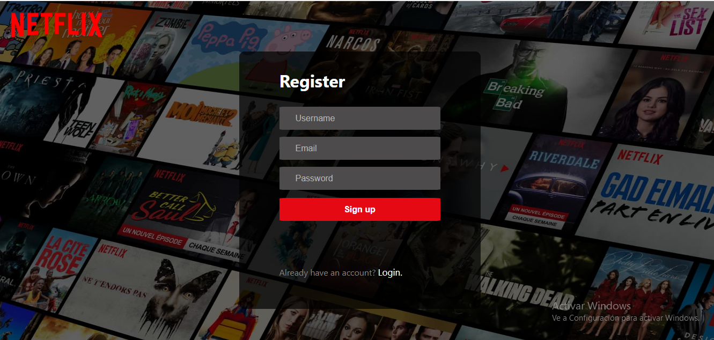
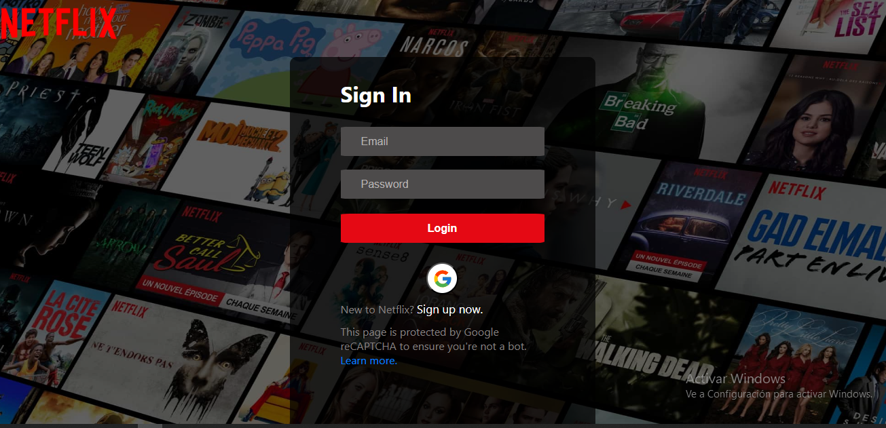
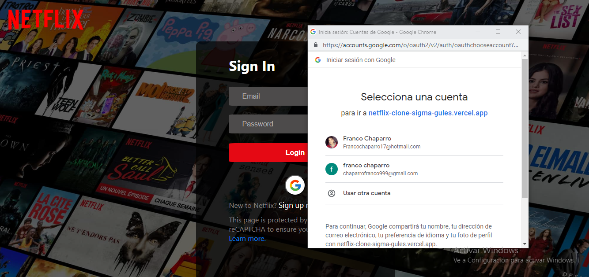
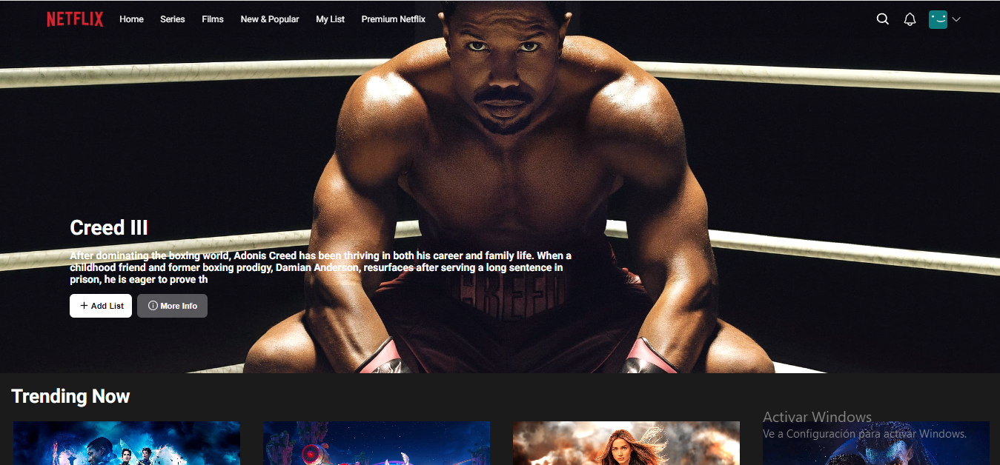
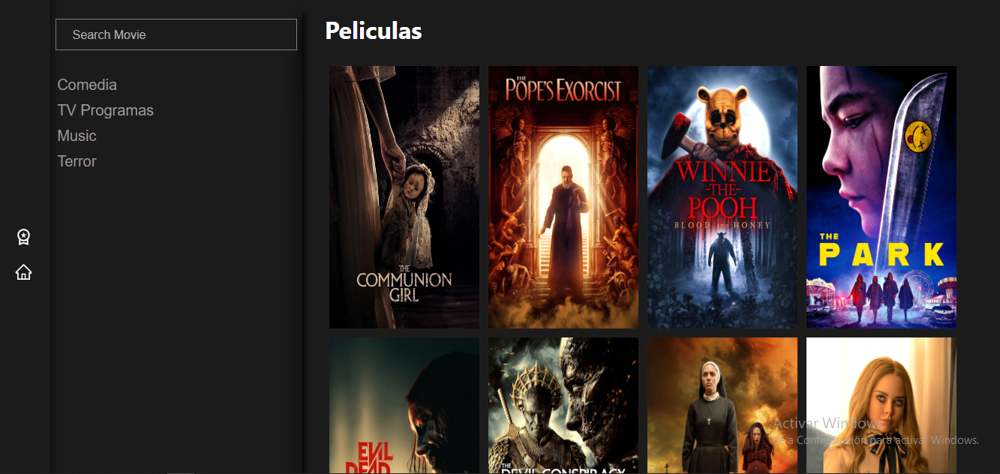
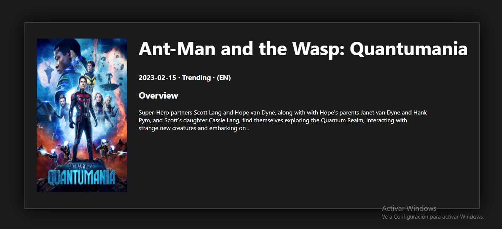

                                                 NETFLIX PROYECT

Desarrollo del BackEnd con Javascript & TypeScript, manejo de sistema CRUD y modelado de la base de datos con Node.Js y PostgreSQL. Desarrollo del FrontEnd con Javascript, modelado y creación de componentes responsive en React utilizando Redux.

Ruta Register, creas tu usario, el form esta totalmente controlado en backend y frontend.

-------------------------------------------------------------------------------------------------------------
Ruta Login, accedes a tu cuenta previamente registrada o podes logear con Google, tiene GoogleAuth, En este preciso momento no tengo cargado el backend por eso lo tengo deshabilitado.

-------------------------------------------------------------------------------------------------------------

Ruta User, Accedes a tu cuenta y te redirige al Home de NETFLIX.

-------------------------------------------------------------------------------------------------------------

El home tiene un slider que va cambiando de portada de pelicula cada 14seg, la navbar cuenta con un sistema de apagado de color cuando esta en la parte superior, y cuando deslizas se hace oscura, tiene varias secciones donde podes ver las diferentes peliculas y un hover con mas details de cada una y una funcion particular de MyList para crear tu propia lista. Justo abajo del todo un footer Con mis datos.

-------------------------------------------------------------------------------------------------------------

Ruta Search, podes buscar las peliculas que desees por nombre, o por generos, y tiene una barra de busqueda totalmente controlada, cuenta con un mini navbar inclinada para redireccionar al Home, y puede acceder a mas detallaes de cada pelicula haciendo un click en la que quieras. Toda la app es responsive.

-------------------------------------------------------------------------------------------------------------

Detalles de la card, genero, fecha de lanzamiento titulo, imagen, lenguaje y una breve descipcion.

